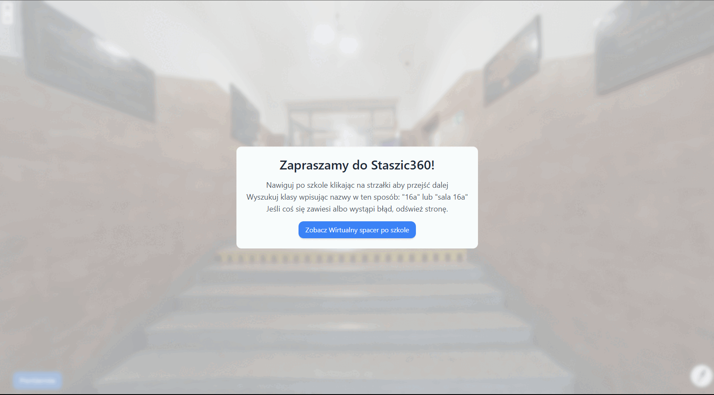

Read the README.md in English <a href="./additional-media/README-en.md">here</a>

# Wirtualny Spacer - I LO im. Stanisława Staszica w Chrzanowie

Interaktywny wirtualny spacer po I Liceum Ogólnokształcącym im. Stanisława Staszica w Chrzanowie.  
Cały projekt jest realizowany przez grupę trzech uczniów szkoły, w pełni bez żadnych korzyści finansowych. Wszystkie zdjęcia wykonane w szkole są dostępne w nieruszonej jakości w folderze <a href="./media/">media</a>.

## 🌐 Demo na żywo

Odwiedź wirtualny spacer na stronie: [Staszic360](https://staszic-virtual-walk.pages.dev) !

## 📝 Opis

Ten projekt zapewnia immersyjne doświadczenie wirtualnego spaceru po korytarzach i salach I LO im. Stanisława Staszica w Chrzanowie. Użytkownicy mogą nawigować po różnych częściach budynku szkoły, odwiedzając sale lekcyjne, korytarze i między innymi sale gimnastyczne jak również gabinety i pomieszczenia nie dostępne typowo dla uczniów szkoły. Strona internetowa jest w pełni dostosowana do standardów dostępności W3C tak aby każdy mógł w pełni.

## 🖼️ Podgląd

## 🚀 Funkcje

- Interaktywny widok w 360 stopniach
- Płynna nawigacja między różnymi lokalizacjami
- Wysokiej jakości zdjęcia panoramiczne
- Funkcjonalność szybkiego dostępu do sal lekcyjnych
- Piękny styl glassmorphism
- Pełna dostępność zgodnie z W3C

## 🤝 Dostępność

Nasza strona wirtualnego spaceru zawiera wbudowane opcje dostępności, aby poprawić doświadczenie każdego użytkownika:

- **Tryb wysokiego kontrastu:** Przełącz na wysoki kontrast dla lepszej widoczności.
- **Zmiana rozmiaru tekstu:** Zwiększ lub zmniejsz rozmiar tekstu dla lepszej czytelności.
- **Przełącznik animacji:** Włącz lub wyłącz animacje, aby dostosować stronę do osobistych preferencji.

## 🛠️ Użyte technologie

- HTML5
- CSS3
- JavaScript
- Panellum.js 

## Znane błędy

- Czasami przy użyciu menu szybkiego dostępu, możemy zobaczyć komunikat " (ścieżka zdjęcia sali) could not be accessed." W takim przypadku należy poprostu kliknąć na salę w menu szybkieg dostępu jeszcze raz. Ten błąd pojawia się dosyć rzadko, a jego powodem jest trudność z załadowaniem zdjęcia przez Cloudflare w odpowiednim czasie. Zdjęcia są dosyć duże a plan, dzięki któremu ta strona jest hostowana, jest darmowy więc czas jaki CPU w hostingu może przeznaczyć na zapytanie od clienta jest ograniczony
- Jeśli jakieś błedy wystąpią w wersji production, zostaną dodane tutaj. Jeśli zauważyłeś/aś jakiś błąd, możesz napisać do jednego z nas najlepiej z zrzutem ekranu albo poprostu opisem błędu.  

## Dla deweloperów

- Jeśli jesteś zainteresowanym rozwinięciem tego projektu albo jesteś poprostu ciekaw jak to dokładniej działa i jak postępował rozwój, sprawdź koniecznie pliki <a href="./LICENSE">LICENSE</a> oraz <a href="./additional-media/devnotes.md">devnotes</a>
- Jeśli chcesz zaproponować coś albo cokolwiek, możesz napisać na <a href="https://t.me/Andrtexh" target="_blank">Telegramie</a>.

### Stworzone z ❤️ przez Michała Bańkowskiego, Mateusza Długaja i Gabriela Świątka 2024-2025

## Ten projekt jest licencjonowany na podstawie **Licencji MIT** (sprawdź <a href="./LICENSE">LICENSE</a>)
