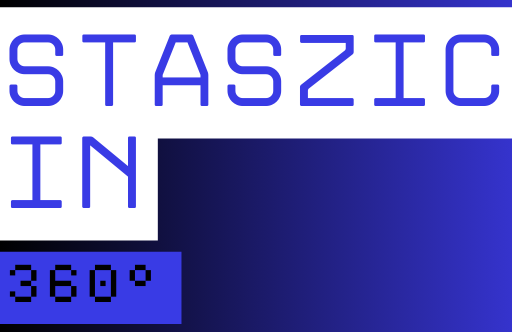
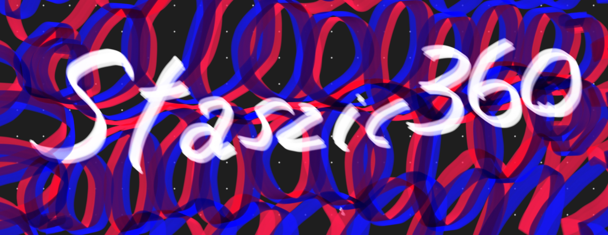
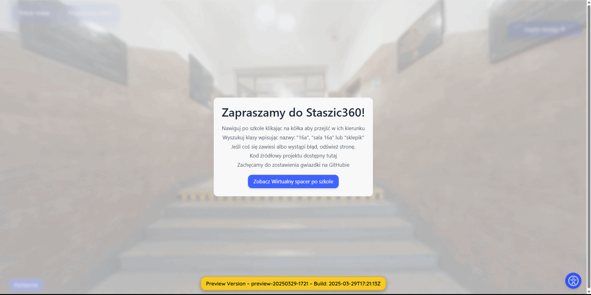

Read the README.md in Polish <a href="../README.md">here</a>

# Virtual Walk - I LO Stanisław Staszic High School in Chrzanów
<!---
<p align="center">
  
</p>--->



  

<!--- 


--->

  

[](https://creativecommons.org/licenses/by-nc-sa/4.0/)  

[](https://t.me/Andrtexh)

An interactive virtual walk through the Stanisław Staszic No. 1 High School in Chrzanów. </br>
The entire project is carried out by a group of three students, completely without any financial benefit. All photos taken at the school are available in their original quality in the <a href="../media/">media</a> folder.

## 🌐 Publicly Approved Project Instances

The project is currently available at the following sites:

👉 [Cloudflare Pages](https://staszic360.pages.dev) – production version  

👉 [GitHub Pages](https://andreansxtech.github.io/Staszic360/) – preview version  

👉 [Spacer.1lo.pl](http://spacer.1lo.pl/) ( No SSL/TLS🔓 ) - Final version, rarely updated

_(Right-click → open in new tab, GitHub does not allow automatic opening)_


## 📝 Description

This project provides an immersive virtual tour experience through the corridors and rooms of Stanisław Staszic No. 1 High School in Chrzanów. Users can navigate through different parts of the school building, visiting classrooms, corridors, gyms, as well as offices and rooms not typically accessible to students. The website is fully adapted to W3C accessibility standards so that everyone can use it.

## 🖼️ Preview



## 🚀 Features

- Interactive 360-degree view
- Smooth navigation between different locations
- High-quality panoramic photos
- Quick access to classrooms
- Beautiful glassmorphism style
- Full accessibility according to W3C

## 🤝 Accessibility

Staszic360 is designed with broad accessibility and inclusivity in mind. We strive to make the project as accessible as possible both technically and in terms of usability.
-  Mobile devices and computers – the tour works on most modern devices with WebGL support.
-  Browsers – we recommend the latest versions of Chrome, Firefox, Edge, or Safari.
-  No login required – access to the tour does not require creating an account.
-  Fast loading – optimized code allows use even with a slower connection.
-  Keyboard navigation – the project supports navigating the interface using the keyboard (tabindex).
-  Initial screen reader support – aria-* attributes have been added to help screen readers better understand the page content. These features will be further developed.
-  Planned improvements – we plan further accessibility enhancements, including better scene descriptions.

## 🛠️ Technologies Used

- HTML5
- CSS3
- JavaScript
- Panellum.js
- Python (automation scripts)

## Known Issues / Problems

- Sometimes when using the quick access menu, you may see the message ```"The file %s could not be accessed."``` In this case, simply click the room in the quick access menu again. This error occurs rarely and is caused by difficulties loading the image from Cloudflare in time. The images are quite large and the plan that allows this site to be hosted is free, so the amount of CPU time the hosting can allocate to a client request is limited.
- When toggling the accessibility feature "Enable / Disable animations", hotspots may move to the top left corner instead of staying where they should. This bug does not affect the functionality of the site. Hotspots return to their place as soon as you move the panorama.
- If any errors occur in the production version, they will be added here. If you notice any bug, you can contact one of us, preferably with a screenshot or just a description of the error.

## For the Curious
- Files are digitally signed to ensure their integrity and authenticity. (See below)
- If you are interested in developing this project further or are simply curious about how it works and how development progressed, be sure to check the <a href="../LICENSE">LICENSE</a> and <a href="./devnotes.md">devnotes</a> files.
- If you want to suggest something or anything else, you can write to us on <a href="https://t.me/Andrtexh" target="_blank">Telegram</a>.

## Signature Verification

The files `index.html`, `script.js`, and `pannellum.css` are digitally signed with GPG to ensure their integrity and authenticity. This means you can be sure that these files have not been modified by third parties since they were signed by us.</br>

Remember to check signatures against the ones from the appropriate Release, not the latest ones.

**Public key**: [AndreansxTech_0x1A5C5CDB_public.asc](../AndreansxTech_0x1A5C5CDB_public.asc)

**Key fingerprint**: 9282 DF55 1096 3273 6618  5B2E 4C80 939B 1A5C 5CDB

**Importing the key (command line):**

```bash
gpg --import AndreansxTech_0x1A5C5CDB_public.asc
```
**Signature verification**
```bash
gpg --verify index.html.sig index.html
gpg --verify pannellum.css.sig pannellum.css
gpg --verify script.js.sig script.js
```
### Project Structure
```
Staszic360/
├── additional-media/
│   └── ...                               ( extra devnotes, icons, diagrams )
├── media/
│   ├── lowscaled_images/
│   │   └── ...                           ( Lower resolution photos )
│   └── ...                               ( panoramas folder )
├── AndreansxTech_0x1A5C5CDB_public.asc - Public key for signature verification
├── check_images.py                     - Python script to check paths
├── index_backup.html                   - Backup copy of index.html
├── index.html                          - Main HTML file
├── index.html.sig                      - Digital signature of index.html
├── LICENSE                             - License file
├── pannellum.css                       - Pannellum stylesheet
├── pannellum.css.sig                   - Digital signature of pannellum.css
├── pannellum.js                        - Pannellum library
├── script.js                           - Main JavaScript file
├── script.js.sig                       - Digital signature of script.js
├── resize_images.py                    - Python script used to reduce image resolution
├── update_paths.py                     - Python script to update image paths
├── build.sh                            - Shell file with Cloudflare build command for Production
├── test.tex                            - LaTeX documentation file
├── test.pdf                            - PDF version of README.md
└── README.md
```
# Rights

## Created with ❤️ by <a href="https://AndreansxTech.github.io/">Michał Bańkowski (*AndreansxTech*)</a>, Mateusz Długaj (*Matkard1*) and Gabriel Świątek (*Simonaven265*) 2025

## This project uses the <a href="https://github.com/mpetroff/pannellum">Pannellum.js</a> library by <a href="https://mpetroff.net/">Matthew Petroff</a>.

### A copy of the Pannellum.js license file is in <a href="../LICENSE-PANNELLUM">LICENSE-PANNELLUM</a>

## This project is licensed under the <a href="../LICENSE">**Creative Commons Attribution-NonCommercial-ShareAlike 4.0 International**</a> (see <a href="../LICENSE">LICENSE</a>)

### As of April 2, 2025, the project is no longer developed under the MIT license. Every new update is subject to the copyright of the **Creative Commons Attribution-NonCommercial-ShareAlike 4.0 International** license.