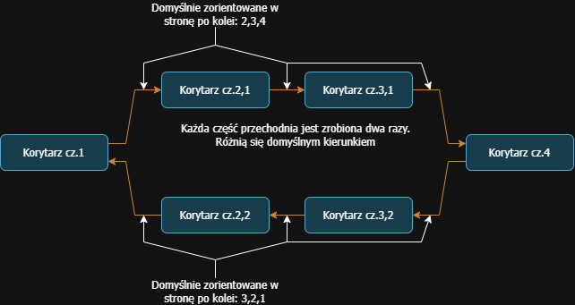

## Ten plik zawiera notatki dla deweloperów

W sprawie czegokolwiek pisz do mnie ( <a href="https://t.me/Andrtexh">AndreansxTech</a> ) na Telegramie.  
Ogólnie fajnie że nie ma tu nawet żadnego backendu. Właściwie to statyczna strona
## Ukryte funkcje
- "index" w polu wyszukiwania sal - pomagało przy sprawdzaniu w wersji production
- "sig" - podpis cyfrowy - użyj np. Kleopatry aby sprawdzić czy ktoś ruszał pliki od czasu podpisania go przez nas, autorów. 
Po wpisaniu pobierze się plik z podpisem odpowiednio: 
sig1 - index.html 
sig2 - panellum.css 
sig3 - panellum.js

Wiadomo że to ta strona to nie coś co możemy skompilować i mieć wątpliwości co do bezpieczeństwa i autentyczności tego pliku. Jednakże ten projekt jest częścią naszego ogólnie poznawania tego wszystkiego. Dlatego nie zaszkodzi na nim odrazu po próbować podpisów cyfrowych itp. Nikomu to nie przeszkodzi w użytkowaniu a nam pozwala na poznanie czegoś nowego.
## Diagramy blokowe

### Zdjęcia i ich obróbka
Specyfikacja sprzętu:
Kamera: Samsung Gear360 ( nie ta wersja z 2017 roku ) model CM-200
- Rozmiar zdjęcia: 7776x3888 px
- Typowa waga zdjęcia surowego zdjęcia to od ok. 5 MB do ok. 8 MB
- 350 dpi
- 24 bity
- 1.2mm
- f/2
- 1/100s
- ISO zazwyczaj około 100-120
- Przeróżne światło, ciężko było zaplanować robienie zdjęć tak aby były idealne warunki za każdym razem 

Zdjęcia na karcie SDXC w kamerze są w 100% surowe, nie podlegały żadnej obróbce. Po pobraniu zdjęcia na telefon ( Samsung Galaxy S8 ) zdjęcia ulegają, bezstratnemu pod względem jakości, połączeniu dwóch zdjęć ( Double fish eye ) aby przejść do equiractangular po to żeby Panellum.js mogło je w ten sposób przerobić w zdjęcie sferyczne. Można również te zdjęcia brać bezpośrednio z karty SDXC i zamienić je ( być może jeszcze bardziej bezstratnie ) do odpowiedniego zdjęcia panoramicznego. Tak więc zdjęcia w folderze <a href="../media/">media</a> podległy jedynie najbardziej jak to możliwe połączeniu dwóch obrazów typu *fish-eye* do *panoramic* 

## Panoramy
Zdjęcia mogą wydawać się dość mylnie nazwane, bo tak jest, ale jednak jest pewien schemat. Sal chyba nie trzeba tłumaczyć. Zazwyczaj jest: "xpiętro=" potem albo "stareskrzydl" albo "noweskrzydl" i potem jakaś cyfra czyli któreś ze zdjęć zrobionych w tej części szkoły. Wszystkie zdjęcia powinny być najlepiej nazwane z małej litery. Dlatego że Cloudflare build environment działa na Linuxie który jest case sensitive. Często był taki dziwny błąd że dodaję jakieś nowe zdjęcie i widzę na Live serverze że strona działa więc pushuje na Githuba. Potem patrzę na stronę i nagle ta sala którą dodałem nie działa. 
